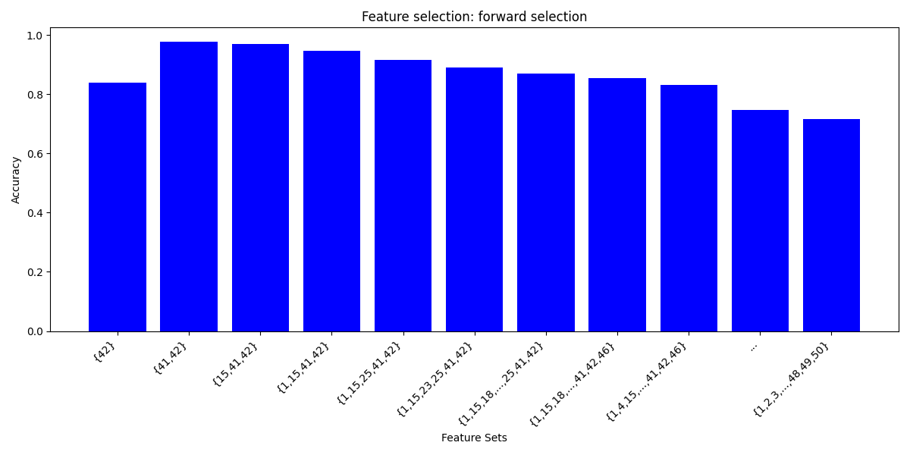
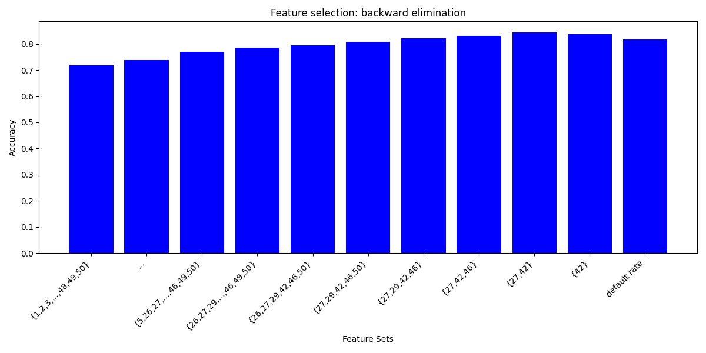

# Nearest Neighbor

 The nearest neighbor algorithm is a simple and intuitive algorithm in machine learning that classifies data points by looking at other points in the neighborhood. It can be seen as a special case of the KNN algorithm \cite{fix1985discriminatory} where \( k=1 \).

``` 
python script_name.py --algorithm forward_selection --test_data ./data/sample_data.txt --debug --normalize_data --norm_type z_norm
```






To evaluate a test data using different algorithms run 
 
```
./bash_run.sh <test_file_path>
```

## Help

For more information and debug commands run with
```
Run command with python3 main.py --help for helper info
```

## Authors

Nebiyou Yismaw

## Acknowledgments


* [README Template](https://github.com/matiassingers/awesome-readme)
